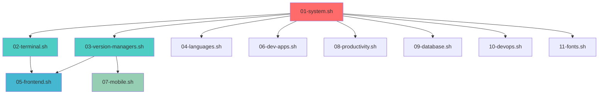

# 📚 Complete Script Guide

> **Comprehensive guide to all development setup scripts**

This guide provides detailed information about each script in the modular Mac development setup.

## 🚀 Quick Start

```bash
# Run the main setup script
./setup.sh

# Or run individual scripts
./scripts/01-system.sh
./scripts/05-frontend.sh
./scripts/09-database.sh
```

---

## 📋 Script Overview

### 🔧 Essential Scripts (Always Recommended)

These scripts provide the foundation for all development work:

| Script | Description | Auto-Install |
|--------|-------------|--------------|
| `01-system.sh` | System Requirements | ✅ |
| `02-terminal.sh` | Terminal & Shell | ✅ |
| `03-version-managers.sh` | Version Managers | ✅ |

### 📦 Optional Scripts (Choose What You Need)

| # | Script | Description | Best For |
|---|---------|-------------|----------|
| 4 | `04-languages.sh` | Programming Languages | Backend development |
| 5 | `05-frontend.sh` | Frontend Tools | Web/mobile development |
| 6 | `06-dev-apps.sh` | Development Apps | Code editing |
| 7 | `07-mobile.sh` | Mobile Development | iOS/Android apps |
| 8 | `08-productivity.sh` | Productivity Tools | Workflow optimization |
| 9 | `09-database.sh` | Database Tools | Data management |
| 10 | `10-devops.sh` | DevOps Tools | Infrastructure |
| 11 | `11-fonts.sh` | Developer Fonts | Better coding experience |

---

## 📖 Detailed Script Documentation

### 1️⃣ System Requirements (`01-system.sh`)

**Purpose:** Essential system foundation for all development

**What it installs:**
- ✅ Xcode Command Line Tools
- ✅ Homebrew package manager
- ✅ Basic system configuration (hidden files in Finder)

**Dependencies:** None (run first)
**Runtime:** ~5-10 minutes
**Required for:** All other scripts

**Usage:**
```bash
./scripts/01-system.sh
```

---

### 2️⃣ Terminal & Shell (`02-terminal.sh`)

**Purpose:** Modern terminal environment with productivity features

**What it installs:**
- 🖥️ **iTerm2** - Better terminal with Dracula theme
- 🐚 **Oh My Zsh** - Powerful shell framework
- ⚡ **PowerLevel10k** - Beautiful, informative prompt
- 🔌 **Zsh plugins** - autosuggestions, syntax highlighting
- 🎨 **Dracula.itermcolors** - Beautiful color scheme
- 📝 **Development aliases** - Git shortcuts, better ls

**Dependencies:** 01-system.sh
**Runtime:** ~3-5 minutes

**Post-install:**
```bash
# Configure PowerLevel10k theme
p10k configure

# Import Dracula theme manually:
# iTerm2 → Preferences → Profiles → Colors → Import → Dracula.itermcolors
```

---

### 3️⃣ Version Managers (`03-version-managers.sh`)

**Purpose:** Manage multiple versions of programming languages

**What it installs:**
- 🚀 **Volta** - Fast Node.js version manager
- 🐍 **pyenv** - Python version manager  
- 📦 **Node.js** (latest LTS via Volta)
- 🐍 **Python** (3.9.6, 3.10.13, 3.12.1 via pyenv)

**Dependencies:** 01-system.sh
**Runtime:** ~10-15 minutes

**Usage:**
```bash
# Node.js management
volta install node@20        # Install specific version
volta pin node@18           # Pin version for project

# Python management  
pyenv install 3.11.5        # Install Python version
pyenv global 3.12.1         # Set global Python version
pyenv local 3.11.5          # Set local Python version
```

---

### 4️⃣ Programming Languages (`04-languages.sh`)

**Purpose:** Additional programming languages for backend development

**What it installs:**
- ☕ **Java JDK** (OpenJDK 21) with JAVA_HOME
- 🐹 **Go** (latest stable)
- 💎 **Ruby** (latest stable)

**Dependencies:** 01-system.sh
**Runtime:** ~5-8 minutes
**Best for:** Backend developers, full-stack developers

**Usage:**
```bash
# Java
java --version
javac HelloWorld.java

# Go
go version
go mod init myproject

# Ruby
ruby --version
gem install bundler
```

---

### 5️⃣ Frontend Tools (`05-frontend.sh`)

**Purpose:** Complete frontend and mobile development toolkit

**What it installs:**
- 🔷 **TypeScript** - Type-safe JavaScript
- 🟢 **Vue CLI & Nuxt CLI** - Vue.js development
- ⚛️ **React Native CLI** - Mobile app development
- 🚀 **Expo CLI & EAS CLI** - Expo development platform
- ⚡ **Vite** - Fast build tool
- 📝 **Storyblok CLI** - Headless CMS
- 🎨 **Sanity CLI** - Headless CMS
- 👀 **Watchman** - File watching (React Native)

**Dependencies:** 02-terminal.sh, 03-version-managers.sh
**Runtime:** ~8-12 minutes
**Best for:** Frontend developers, mobile developers

**Usage:**
```bash
# Vue.js
vue create my-vue-app
nuxt init my-nuxt-app

# React Native
npx react-native@latest init MyApp
npx create-expo-app@latest MyExpoApp

# Build tools
npm create vite@latest my-vite-app
npx serve ./dist

# Headless CMS
storyblok init
sanity init
```

---

### 6️⃣ Development Apps (`06-dev-apps.sh`)

**Purpose:** Code editors and development applications

**What it installs:**
- 💻 **Visual Studio Code** with 20+ extensions
- 🤖 **Cursor** - AI-powered editor  
- ⚡ **Zed** - High-performance editor
- 📝 **TextMate** - Lightweight editor
- 🔧 **Git & GitHub tools** - git-flow, GitHub CLI, GitHub Desktop

**Key VS Code Extensions:**
- GitHub Copilot, AWS Toolkit (Amazon Q)
- Vue Language Features, Python, Go
- GitLens, ESLint, Prettier
- Auto Close Tag, Better Comments
- Material Icon Theme

**Dependencies:** 01-system.sh
**Runtime:** ~10-15 minutes
**Best for:** All developers

**Usage:**
```bash
# VS Code
code .                    # Open current directory
code myfile.js           # Open specific file

# GitHub CLI
gh auth login            # Authenticate
gh repo create myrepo    # Create repository
gh pr create             # Create pull request

# Git Flow
git flow init            # Initialize git flow
git flow feature start myfeature
```

---

### 7️⃣ Mobile Development (`07-mobile.sh`)

**Purpose:** Complete iOS and Android development environment

**What it installs:**
- 🤖 **Android Studio** - Android development IDE
- 📱 **iOS development tools** - xcodes, SwiftLint, ios-deploy
- 📦 **CocoaPods** - iOS dependency manager
- ☕ **Java JDK** (if not already installed)

**Dependencies:** 01-system.sh, 03-version-managers.sh
**Runtime:** ~20-30 minutes (large downloads)
**Best for:** Mobile app developers

**Manual Steps Required:**
- Install Xcode from App Store (~15GB)
- Accept Xcode license: `sudo xcodebuild -license accept`
- Create Android Virtual Devices in Android Studio

**Usage:**
```bash
# React Native
npx react-native run-android    # Run on Android
npx react-native run-ios        # Run on iOS

# iOS
pod install                     # Install iOS dependencies
xcodes install --latest         # Install specific Xcode version

# Android
$ANDROID_HOME/emulator/emulator -avd Pixel_API_35
```

---

### 8️⃣ Productivity Tools (`08-productivity.sh`)

**Purpose:** Workflow optimization and productivity applications

**What it installs:**
- 🔍 **Raycast** - Advanced Spotlight replacement
- 🪟 **Rectangle** - Window management
- 📋 **Maccy** - Clipboard history manager
- 📝 **Obsidian** - Note-taking application
- 🌐 **Browsers** - Firefox, Brave (testing)
- 🛠️ **Developer utilities** - OrbStack, Postman, Figma

**Dependencies:** 01-system.sh
**Runtime:** ~5-8 minutes
**Best for:** All users wanting better productivity

**Setup Required:**
- **Raycast**: Set CMD+Space shortcut, install extensions
- **Rectangle**: Configure window shortcuts (⌘+⌥+arrows)
- **Maccy**: Set clipboard shortcut (⌘+Shift+V)
- **Obsidian**: Create vault, configure sync (optional)

**Usage:**
```bash
# Raycast shortcuts (after setup)
CMD+Space                # Open Raycast
# Search: "gh" for GitHub, "brew" for Homebrew

# Rectangle shortcuts  
CMD+OPT+Left            # Snap window left
CMD+OPT+Right           # Snap window right
CMD+OPT+F               # Maximize window
```

---

### 9️⃣ Database Tools (`09-database.sh`)

**Purpose:** Database development and management tools

**What it installs:**
- 🐘 **PostgreSQL 15** - Production database
- 🖥️ **DBeaver Community Edition** - Universal database GUI client
- ⚡ **Supabase CLI** - Backend-as-a-service
- 🏗️ **Database configuration** - Auto-start, PATH setup

**Dependencies:** 01-system.sh
**Runtime:** ~5-10 minutes
**Best for:** Full-stack developers, backend developers

**Usage:**
```bash
# PostgreSQL
createdb myproject              # Create database
psql myproject                  # Connect to database
brew services start postgresql@15  # Start service

# Supabase
supabase init                   # Initialize project
supabase start                  # Start local development
supabase login                  # Login to Supabase

# Connection strings
postgresql://localhost:5432/myproject
```

---

### 🔟 DevOps Tools (`10-devops.sh`)

**Purpose:** Frontend deployment and command line utilities

**What it installs:**
- ☁️ **AWS CLI** - For S3, CloudFront, Lambda deployment
- 🌐 **ngrok** - Local tunneling for sharing dev servers
- 🛠️ **Command line utilities** - jq, fzf, eza, wget, tree
- 📊 **JSON processing** - jq for API responses
- 🔍 **Fuzzy finding** - fzf for terminal productivity

**Dependencies:** 01-system.sh
**Runtime:** ~8-12 minutes
**Best for:** DevOps engineers, cloud developers

**Usage:**
```bash
# AWS CLI (for frontend deployment)
aws configure                 # Setup credentials
aws s3 sync ./dist s3://bucket  # Deploy static site
aws cloudfront create-invalidation  # Refresh CDN

# Local tunneling
ngrok http 3000              # Expose local port 3000

# Command line utilities
jq '.data[] | .name' api.json  # Process JSON
fzf                          # Fuzzy find files
eza -la                      # Better file listing
```

---

### 1️⃣1️⃣ Developer Fonts (`11-fonts.sh`)

**Purpose:** Beautiful, functional fonts for coding

**What it installs:**
- 🔤 **Fira Code** - Popular font with ligatures
- ⚡ **JetBrains Mono** - Excellent readability
- 🎨 **Additional programming fonts** - SF Mono, Menlo alternatives

**Dependencies:** 01-system.sh
**Runtime:** ~2-3 minutes
**Best for:** All developers

**Usage:**
After installation, update your editor/terminal font settings:
- **VS Code**: Preferences → Settings → Font Family
- **iTerm2**: Preferences → Profiles → Text → Font
- **Terminal**: Preferences → Profiles → Font

---

## 🎯 Common Usage Patterns

### Full Stack Web Developer
```bash
# Run these scripts:
./setup.sh
# Choose: 4 5 6 8 9 (Languages, Frontend, Dev Apps, Productivity, Database)
```

### Mobile App Developer  
```bash
# Run these scripts:
./setup.sh
# Choose: 5 6 7 8 11 (Frontend, Dev Apps, Mobile, Productivity, Fonts)
```

### DevOps Engineer
```bash
# Run these scripts:
./setup.sh  
# Choose: 4 6 8 9 10 (Languages, Dev Apps, Productivity, Database, DevOps)
```

### Minimalist Setup
```bash
# Just essentials + code editor
./setup.sh
# Choose: 6 (Dev Apps only)
```

---

## 🔧 Maintenance & Updates

### Update All Tools
```bash
# Homebrew packages
brew update && brew upgrade

# Node.js packages  
volta install node@latest

# Python packages
pyenv install 3.12.2
pyenv global 3.12.2

# VS Code extensions
code --list-extensions | xargs -L 1 echo code --install-extension
```

### Check Installation Status
```bash
./check-setup.sh  # Verify what's installed
```

### Re-run Individual Scripts
```bash
# Safe to re-run any script
./scripts/05-frontend.sh  # Updates/installs missing tools
```

---

## 🚨 Troubleshooting

### Common Issues

**"Command not found" after installation:**
```bash
# Reload shell configuration
source ~/.zshrc
# Or restart terminal completely
```

**Homebrew permissions:**
```bash
sudo chown -R $(whoami) $(brew --prefix)/*
```

**Python/Node version issues:**
```bash
# Check active versions
node --version
python --version

# Reset if needed
volta install node@lts
pyenv global 3.12.1
```

**VS Code 'code' command not working:**
```bash
# Add to PATH manually
echo 'export PATH="/Applications/Visual Studio Code.app/Contents/Resources/app/bin:$PATH"' >> ~/.zshrc
source ~/.zshrc
```

### Getting Help

1. **Check script logs** - Each script shows detailed output
2. **Run verification** - `./check-setup.sh` shows what's working
3. **Individual scripts** - Run specific scripts to fix issues
4. **Manual installation** - Check individual tool documentation

---

## 📊 Script Dependencies



**Legend:**
- 🔴 **Red**: Essential foundation
- 🟢 **Green**: Essential for development  
- 🔵 **Blue**: Frontend/web development
- 🟡 **Yellow**: Mobile development
- ⚪ **White**: Independent optional tools

---

## 🎉 What's Next?

After running your chosen scripts:

1. **Restart your terminal** or run `source ~/.zshrc`
2. **Configure PowerLevel10k**: `p10k configure`
3. **Setup authentication**:
   - GitHub: `gh auth login`
   - AWS: `aws configure`
   - Supabase: `supabase login`
4. **Import iTerm2 theme** manually
5. **Configure productivity apps** (Raycast, Rectangle shortcuts)
6. **Start coding!** 🚀

---

*Happy coding! This modular approach lets you install exactly what you need, when you need it.* ✨